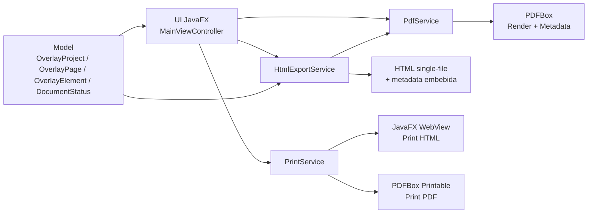

# PDF Overlay Designer

Editor desktop en **JavaFX + Maven** para diseñar overlays HTML alineados sobre PDFs preimpresos, con salida compatible con **ERPNext / Jinja**.

---

## Propósito

Resolver el diseño e impresión de formatos preimpresos con precisión:

1. Cargar PDF base (una o múltiples páginas).
2. Diseñar capa overlay visual.
3. Exportar HTML imprimible conservando posiciones relativas.
4. Reutilizar el HTML en plantillas ERPNext/Frappe.

---

## Features actuales

- Carga de PDF multipágina (`Open PDF`).
- Reapertura de diseño desde HTML generado por la app (`Open HTML`).
- Editor visual tipo paint con herramientas:
  - `Select`
  - `Text`
  - `Label`
  - `Button`
  - `Point`
  - `Table`
- IDs secuenciales por tipo, sin UUID:
  - `textbox1`, `textbox2`...
  - `label1`, `button1`, `marker1`, `table1`...
- Texto por defecto al insertar: `tipo + contador`.
- Si al insertar se hace click sobre otro control:
  - se omite inserción
  - cambia automáticamente a `Select`.
- Selección visual clara del elemento activo.
- Eliminación con `DEL` y deshacer borrado con `Ctrl/Cmd+Z`.
- Panel derecho con inspector:
  - edición de `ID`
  - edición de texto
  - configuración de tabla
  - selector de estado documental.
- Barra de estado:
  - mensajes operativos
  - tamaño de documento/página (`in` y `pt`)
  - zoom y porcentaje.
- Vista de trabajo por pestañas:
  - `Graphic Mode`
  - `HTML Source`.
- Visor `HTML Source` mejorado:
  - resaltado básico de sintaxis HTML/CSS/Jinja
  - selector de bloques: `Full document`, `HEAD`, `STYLE`, `BODY`, `Metadata`.
- Exportación HTML con opciones:
  - incluir o no fondo PDF embebido
  - exportar fuente
  - exportar colores de tabla
  - exportar bordes de tabla
  - exportar bordes de campos de texto.
- Impresión separada:
  - `Print HTML`
  - `Print PDF`.
- Splash screen.
- Icono de aplicación e iconos en botones.

---

## Zoom y navegación

- Zoom por slider (`0%` a `300%`, con `100% = escala real 1.0`).
- Al abrir PDF/HTML aplica **fit automático al viewport** (ancho/alto visible de la ventana).
- Atajos de zoom:
  - `Ctrl/Cmd + +` → zoom in
  - `Ctrl/Cmd + -` → zoom out
  - `Ctrl/Cmd + rueda mouse` → zoom in/out.

---

## Atajos estándar

- `Ctrl/Cmd + Q` → salir de la app.
- `Ctrl/Cmd + +` → zoom in.
- `Ctrl/Cmd + -` → zoom out.
- `Ctrl/Cmd + Z` → deshacer último borrado.
- `DEL` → borrar elemento seleccionado.

---

## Tablas en overlay (sin DIV)

La tabla de overlay se exporta usando solo etiquetas de tabla HTML:

- `<table>`
- `<colgroup>/<col>`
- `<thead>/<th>`
- `<tbody>/<tr>/<td>`

Configuración disponible:

- cantidad de columnas (al insertar)
- ancho total de tabla (%)
- anchos por columna (%)
- filas de detalle (`1` o `4`)
- encabezados.

**Restricción de diseño aplicada:** no se usa `<div>` para representar la tabla overlay exportada.

---

## Estado documental y marca de agua

En el panel derecho:

- check: `Enable status watermark`
- selector: `BORRADOR` / `ANULADO`.

Comportamiento de guardado/exportación:

1. Si el check está **activado**:
   - se exporta marca de agua CSS sobre todo el documento
   - se guarda metadata de estado (`DOC_STATUS_ENABLED=true` y `DOC_STATUS=...`).
2. Si el check está **desactivado**:
   - no se exporta marca de agua
   - no se incluye estado activo en el body
   - metadata conserva `DOC_STATUS_ENABLED=false`.

Al reabrir HTML, la app restaura ese estado y su activación.

---

## Compatibilidad ERPNext / Jinja

La salida está pensada para reportes HTML + Jinja:

- layout de página con `table.print-page`
- overlay estructurado con tablas
- soporte natural para bloques Jinja (`{{ }}` / ``) en flujos posteriores.

---

## Stack técnico

- Java 21 (LTS)
- Maven
- JavaFX 21.0.5 (`controls`, `swing`, `web`)
- Apache PDFBox 3.0.3
- JUnit 5

---

## Arquitectura



---

## Estructura de paquetes

```text
src/main/java/com/example/pdfoverlay
├── Launcher.java
├── PdfOverlayApplication.java
├── model
│   ├── DocumentStatus.java
│   ├── OverlayElement.java
│   ├── OverlayElementType.java
│   ├── OverlayPage.java
│   ├── OverlayProject.java
│   ├── PdfDocumentMetadata.java
│   └── PdfPageMetadata.java
├── service
│   ├── ExportOptions.java
│   ├── HtmlExportService.java
│   ├── PdfService.java
│   └── PrintService.java
└── ui
    ├── ButtonIconFactory.java
    ├── EditorTool.java
    └── MainViewController.java
```

---

## Flujo recomendado de uso

1. `Open PDF`.
2. Insertar y posicionar controles en `Graphic Mode`.
3. Ajustar propiedades en panel derecho (ID, texto, tabla, estado).
4. Revisar `HTML Source` para validar salida.
5. `Save HTML As...` y elegir opciones de exportación.
6. Reabrir luego con `Open HTML` para continuar edición.
7. Imprimir con `Print HTML` o `Print PDF`.

---

## Ejecución

### Requisitos

- JDK 21
- Maven 3.9+

### Ejecutar

```bash
mvn clean javafx:run
```

### Ejecutar tests

```bash
mvn test
```

### Empaquetar

```bash
mvn -DskipTests package
```

### Crear instalador para Windows (EXE)

Prerequisitos:

- JDK 21 (incluye `jpackage`)
- WiX Toolset v3.x con `light.exe` y `candle.exe` en `PATH`

Comando:

```bash
mvn -DskipTests package -Pwindows-installer
```

Salida esperada:

- `target/installer/PDFOverlayDesigner-1.0.0.exe` (o versión correspondiente)

---

## IntelliJ IDEA

Para evitar error de runtime JavaFX faltante:

- Main class: `com.example.pdfoverlay.Launcher`
- JDK: `21`
- proyecto Maven importado correctamente
- ejecutar con configuración de aplicación Java (no clase JavaFX directa).

---

## Salida HTML

- Archivo único `.html`.
- Metadata embebida para re-edición (`PDF_OVERLAY_METADATA_BEGIN/END`).
- Opción de guardar con o sin fondo PDF embebido.
- `table.print-page` exporta `padding: 0`.

---

## Límites conocidos

- `Open HTML` requiere HTML generado por esta app (por metadata interna).
- El tamaño del HTML crece con cantidad de páginas y DPI si se embebe fondo PDF.
- En impresión física, puede requerirse calibración inicial según impresora.

---

## Colaboración

- Guía de contribución: [CONTRIBUTING.md](./CONTRIBUTING.md)

---

## Autoría

- **Omar Berroteran**

---

## Licencia

Este proyecto está licenciado bajo **Apache-2.0**.

- Texto legal completo: [LICENSE](./LICENSE)
- Aviso del proyecto: [NOTICE](./NOTICE)
