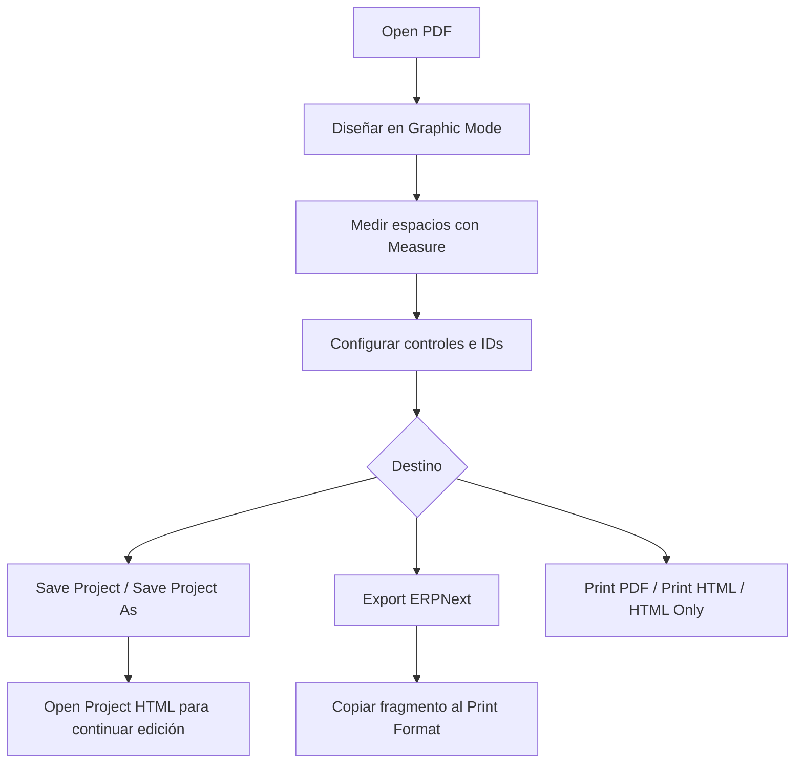
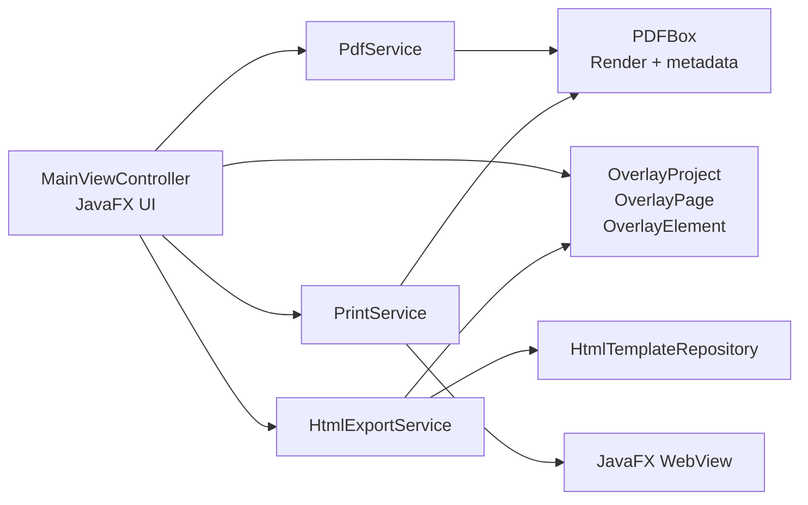

# PDF Overlay Designer

Editor desktop en **JavaFX + Maven** para diseñar overlays HTML alineados
sobre PDFs preimpresos, imprimirlos y exportarlos como fragmentos compatibles
con **ERPNext / Frappe Print Format**.

## Propósito

Resolver el diseño de formatos preimpresos con medidas físicas reales:

1. Cargar un PDF base de una o varias páginas.
2. Diseñar controles HTML sobre la página.
3. Medir espacios, tablas y columnas en milímetros.
4. Guardar el proyecto para continuar edición.
5. Exportar solo el HTML imprimible para ERPNext/Frappe.
6. Imprimir PDF original, HTML con fondo o HTML estricto.

## Estado Actual

- UI JavaFX con selector de temas: JavaFX, Swing/Java básicos y modo oscuro.
- Reglas superior/lateral, grilla en centímetros y scrollbars con contraste.
- Menú `File` con acciones de abrir, guardar, exportar, imprimir y salir.
- Toolbar superior para impresión, navegador y herramientas de edición.
- Barra inferior compacta con navegación de páginas y zoom.
- Vista `Graphic Mode` y vista `HTML Source`.
- Guardado de proyecto separado de exportación.
- Exportación ERPNext sin imagen original y sin metadata editable.
- Impresión PDF/imagen original.
- Impresión HTML con PDF embebido.
- Impresión estricta de solo HTML.
- Apertura del HTML estricto en navegador por defecto.

## Herramientas de Edición

- `Select`: selecciona, mueve y redimensiona controles.
- `Text`: inserta campos de texto.
- `Label`: inserta etiquetas.
- `Button`: inserta controles visuales tipo botón.
- `Point`: inserta marcadores.
- `Table`: inserta tablas HTML reales.
- `Measure`: dibuja un rectángulo temporal para obtener `W x H` en mm.

Los controles seleccionados muestran handles estándar de resize. Al
redimensionar una tabla, el ancho total y los anchos de columnas se actualizan
en milímetros y se reflejan en el inspector.

La herramienta `Measure` no guarda datos en el proyecto. Su recuadro temporal
se borra al hacer click posterior o presionar cualquier tecla; el último valor
queda visible junto al botón.

## Guardado, Exportación e Impresión

`Save Project` y `Save Project As...` guardan un archivo HTML editable por la
aplicación. Ese archivo conserva metadata interna y, cuando corresponde, la
imagen original embebida para poder continuar editando.

`Export ERPNext...` genera el HTML para usar en Print Format. Esta salida no
incluye metadata editable ni imagen original. El export empieza directamente
con los estilos de la aplicación dentro del body lógico del formato:

```html
<style>
/* CSS generado por esta aplicación */
</style>
<div class="preprinted-page">
    <!-- páginas y controles exportados -->
</div>
```

La plantilla base usada para documento completo no incluye llamadas Jinja de
CSS externo. Los estilos generados por esta aplicación se insertan dentro de
`.print-format`, no en `<head>`.

```html
<!DOCTYPE html>
<html>
<head>
</head>
<body>
    <div class="print-format-gutter">
        <div class="print-format">
            <style>{{ print_style }}</style>
            {{ body }}
        </div>
    </div>
</body>
</html>
```

## Reglas de Layout

- Posicionamiento físico en `mm`.
- No usar porcentajes para `top`, `left`, `width` ni `height` exportados.
- Tablas con ancho total y columnas en milímetros.
- Campos sueltos con `position: absolute`.
- Una tabla de overlay se exporta como tabla HTML real.
- El PDF/imagen original solo se embebe al guardar proyecto, no al exportar.
- Los estilos propios de la aplicación nunca van en `<head>`.

## Flujo Recomendado



## Arquitectura



Documentación ampliada:

- [Guía de uso](docs/USAGE.md)
- [Arquitectura](docs/ARCHITECTURE.md)
- [Flujos de guardado/exportación](docs/EXPORT_AND_SAVE.md)

## Atajos

- `Ctrl/Cmd + Q`: salir.
- `Ctrl/Cmd + +`: zoom in.
- `Ctrl/Cmd + -`: zoom out.
- `Ctrl/Cmd + rueda mouse`: zoom in/out.
- `Ctrl/Cmd + Z`: deshacer último borrado.
- `DEL`: borrar elemento seleccionado.
- Cualquier tecla: limpia el recuadro temporal de medición si está visible.

## Stack Técnico

- Java 21
- Maven
- JavaFX 21.0.5 (`controls`, `swing`, `web`)
- Apache PDFBox 3.0.3
- JUnit 5

## Estructura

```text
src/main/java/com/example/pdfoverlay
├── Launcher.java
├── PdfOverlayApplication.java
├── model
├── service
└── ui
```

Recursos relevantes:

```text
src/main/resources
├── icons/app-icon.png
├── styles/app.css
└── templates/erpnext/print-format.html
```

## Ejecución

Requisitos:

- JDK 21
- Maven 3.9+

Ejecutar:

```bash
mvn clean javafx:run
```

Tests:

```bash
mvn test
```

Empaquetar:

```bash
mvn -DskipTests package
```

Instalador Windows:

```bash
mvn -DskipTests package -Pwindows-installer
```

Salida esperada:

```text
target/installer/PDFOverlayDesigner-1.0.0.exe
```

## Límites Conocidos

- `Open Project HTML` requiere metadata generada por esta aplicación.
- El HTML de proyecto puede crecer si guarda PDF embebido con alto DPI.
- La impresión física puede requerir calibración según impresora.

## Licencia

Apache-2.0.

- [LICENSE](LICENSE)
- [NOTICE](NOTICE)
- [CONTRIBUTING.md](CONTRIBUTING.md)
