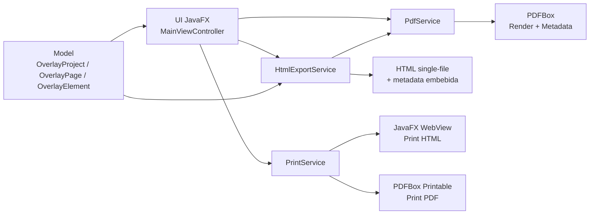

# PDF Overlay Designer

**Editor desktop en JavaFX para diseñar overlays HTML alineados milimétricamente sobre PDFs preimpresos**, con exportación en un solo archivo HTML compatible con flujos de reportes en ERPNext/Jinja.

---

## Propósito

Este proyecto resuelve un problema común en formatos preimpresos:

1. Diseñar posiciones exactas sobre un PDF base (formularios, plantillas, hojas preimpresas).
2. Exportar una capa HTML imprimible que conserve alineación física en papel.
3. Reutilizar esa salida en integraciones tipo HTML + Jinja (ERPNext / Frappe).

El editor permite ubicar elementos por coordenadas relativas (`%`), lo que mantiene la proporción en cambios de zoom y en impresión.

---

## Características principales

- Carga de PDF multipágina.
- Editor visual simple tipo "paint" para insertar/mover elementos:
  - `Text`
  - `Label`
  - `Button`
  - `Point` (marca)
  - `Table` (configurable)
- Navegación de páginas (`Prev` / `Next`).
- Barra de estado con:
  - mensajes operativos
  - tamaño del documento/página (`in` y `pt`)
  - control de zoom y porcentaje actual
- Exportación **single-file** (`.html`) con:
  - fondo PDF embebido en Base64
  - metadata embebida para reabrir el diseño
- Apertura de HTML previamente generado por la app (`Open HTML`).
- Impresión separada:
  - `Print HTML`
  - `Print PDF`
- Splash screen de inicio.
- Botonera con íconos vectoriales (sin librerías extras).

---

## Compatibilidad con ERPNext / Jinja

El HTML exportado está estructurado con `table / tr / td` para facilitar adaptación a plantillas de impresión basadas en HTML/Jinja.

Puntos clave:

- El layout principal de página usa tabla (`table.print-page`).
- Cada elemento overlay también se representa con tablas (`table.overlay-item`).
- El control de tabla exporta `<table>` real con `<th>` y filas de detalle sin usar `<div>`.
- La salida es HTML estándar, fácilmente transformable a un Print Format de ERPNext.

---

## Stack técnico

- Java 21 (LTS)
- Maven
- JavaFX 21.0.5 (`controls`, `swing`, `web`)
- Apache PDFBox 3.0.3
- JUnit 5

---

## Arquitectura



### Estructura de paquetes

```text
src/main/java/com/example/pdfoverlay
├── Launcher.java
├── PdfOverlayApplication.java
├── model
│   ├── OverlayElement.java
│   ├── OverlayElementType.java
│   ├── OverlayPage.java
│   ├── OverlayProject.java
│   ├── PdfDocumentMetadata.java
│   └── PdfPageMetadata.java
├── service
│   ├── PdfService.java
│   ├── HtmlExportService.java
│   └── PrintService.java
└── ui
    ├── MainViewController.java
    ├── EditorTool.java
    └── ButtonIconFactory.java
```

---

## Modelo de posicionamiento

Cada elemento se guarda con valores relativos:

- `xRatio`, `yRatio`
- `widthRatio`, `heightRatio`

Esto permite:

1. independencia del DPI de pantalla
2. consistencia al escalar zoom
3. mejor estabilidad al imprimir en tamaños físicos reales

---

## Flujo de uso

1. `Open PDF`
2. Seleccionar herramienta (`Text`, `Label`, `Button`, `Point`)
3. Clic sobre el canvas para insertar
4. Cambiar a `Select` y arrastrar para ajustar posición
5. Editar `ID` (único) y texto del elemento desde panel derecho
6. En elementos `Table`, configurar:
   - ancho por columna (`%`, separado por comas)
   - filas de detalle (`1` o `4`)
7. Guardar con `Save HTML As...` y seleccionar opciones de exportación:
   `General: export font`, `Tables: export colors`, `Tables: export borders`, `Text fields: export borders`.
8. Reabrir edición con `Open HTML` cuando se requiera
9. Imprimir con `Print HTML` o `Print PDF`

---

## Ejecución

### Requisitos

- JDK 21 instalado
- Maven 3.9+

### Ejecutar por Maven

```bash
mvn clean javafx:run
```

### Ejecutar tests

```bash
mvn test
```

### Empaquetar

```bash
mvn -DskipTests package
```

---

## Ejecución desde IntelliJ IDEA

Para evitar el error de runtime JavaFX faltante en algunos escenarios del IDE:

- Main class: `com.example.pdfoverlay.Launcher`
- JDK: `21`
- Classpath: módulo Maven del proyecto

---

## Formato de salida HTML

La exportación genera un `.html` autocontenido:

- CSS de impresión incluido
- **`Save HTML As...`: exporta solo overlay (sin fondo PDF)** para facilitar plantillas ERPNext/Jinja.
- `Print HTML`: genera HTML temporal con fondo PDF embebido en `data:image/png;base64,...`.
- Bloque de metadata embebido (`PDF_OVERLAY_METADATA_BEGIN/END`) para re-edición

Esto habilita:

1. distribución simple (un solo archivo)
2. versionado sencillo en Git
3. apertura posterior sin perder posiciones

---

## Impresión

- `Print HTML`:
  - genera HTML temporal
  - usa `WebView` + `PrinterJob`
- `Print PDF`:
  - imprime el PDF original vía PDFBox

Recomendación operativa:

- usar márgenes de impresora en `0` cuando el dispositivo lo permita
- validar offset físico inicial en una impresión de prueba

---

## Estado actual y límites conocidos

- La re-apertura (`Open HTML`) requiere que el archivo haya sido generado por esta aplicación (por su metadata interna).
- Al ser single-file con imágenes embebidas, el tamaño del HTML crece según páginas y DPI.
- El HTML exportado está optimizado para impresión/layout, no para interacción web dinámica.

---

## Próximas mejoras sugeridas

- Guardado de proyecto nativo (`.json`) además de HTML.
- Snapping a rejilla / guías.
- Resize handles para redimensionar elementos visualmente.
- Importación/exportación de presets por tipo de documento.
- Modo "plantilla ERPNext" con placeholders Jinja configurables por elemento.

---

## Calidad y pruebas

Actualmente incluye pruebas unitarias base sobre el modelo.

Comandos verificados:

```bash
mvn test
mvn -DskipTests package
```

---

## Licencia

Pendiente de definir (`LICENSE`).

Si lo vas a publicar en GitHub, se recomienda agregar una licencia explícita (por ejemplo: MIT o Apache-2.0).
