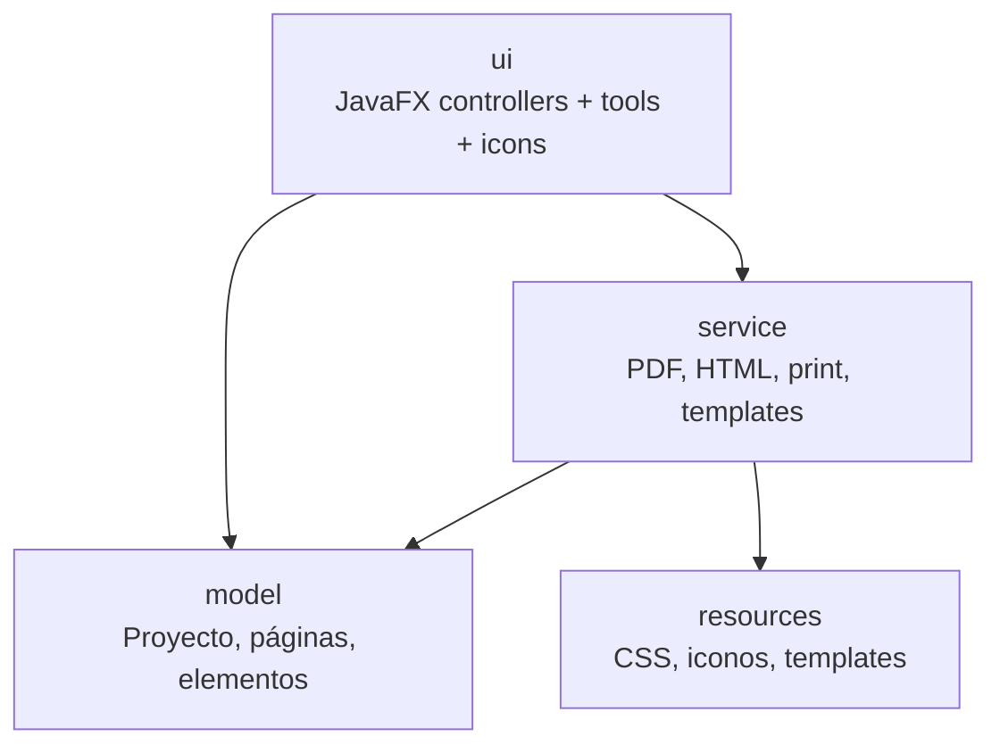
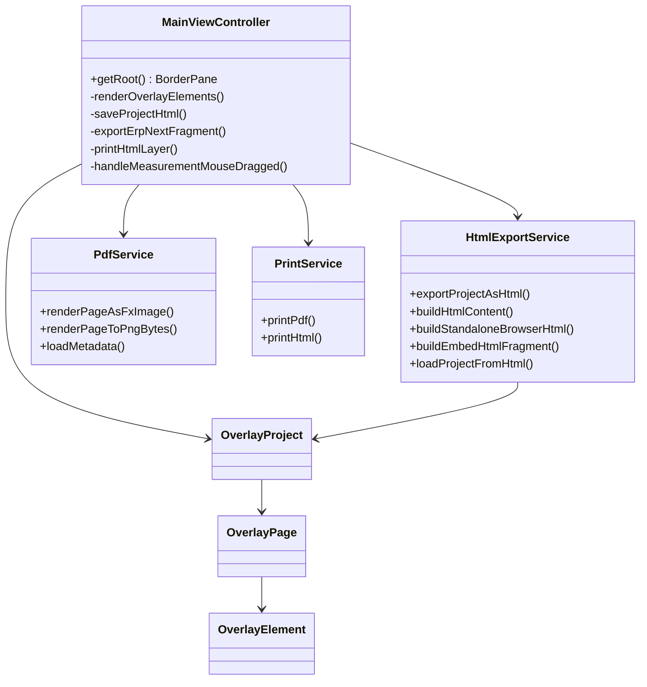
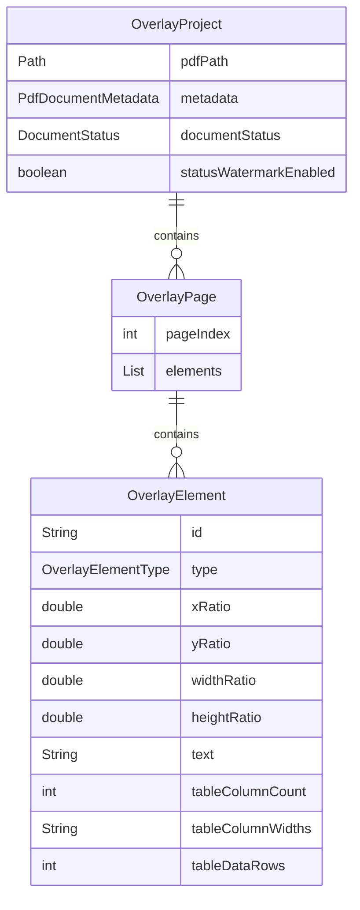
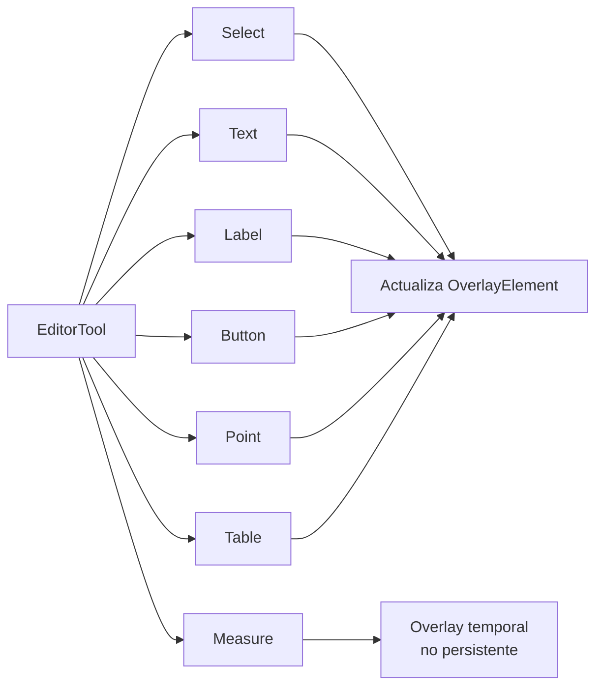
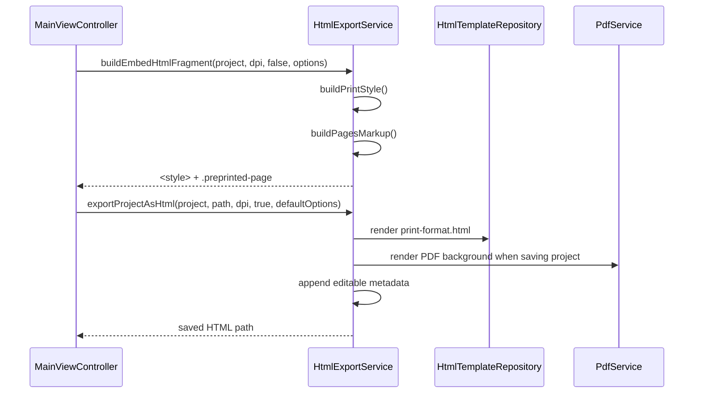

# Arquitectura

## Capas

## Responsabilidades

| Capa | Responsabilidad |
| --- | --- |
| `ui` | Interacción JavaFX, herramientas, inspector, temas y estado visual. |
| `service` | Render PDF, generación HTML, impresión y carga/guardado. |
| `model` | Estado editable del proyecto y validaciones básicas. |
| `resources` | CSS de UI, iconos y plantilla HTML base. |

## Clases Principales

## Modelo de Proyecto

Las coordenadas internas se conservan como ratios para adaptarse al render de
preview. La exportación convierte esos ratios a milímetros usando metadata
física de la página.

## Herramientas de UI

`Measure` es deliberadamente temporal. No se agrega a `OverlayPage`, no se
guarda y no se exporta.

## Exportación HTML

## Reglas de Mantenibilidad

- No mezclar guardado de proyecto con exportación.
- No poner estilos generados por la app en `<head>`.
- No agregar imagen original a `Export ERPNext`.
- No persistir herramientas temporales.
- Mantener tablas exportadas con anchos directos en `mm`.
- Mantener acciones de archivo en menú `File`.
