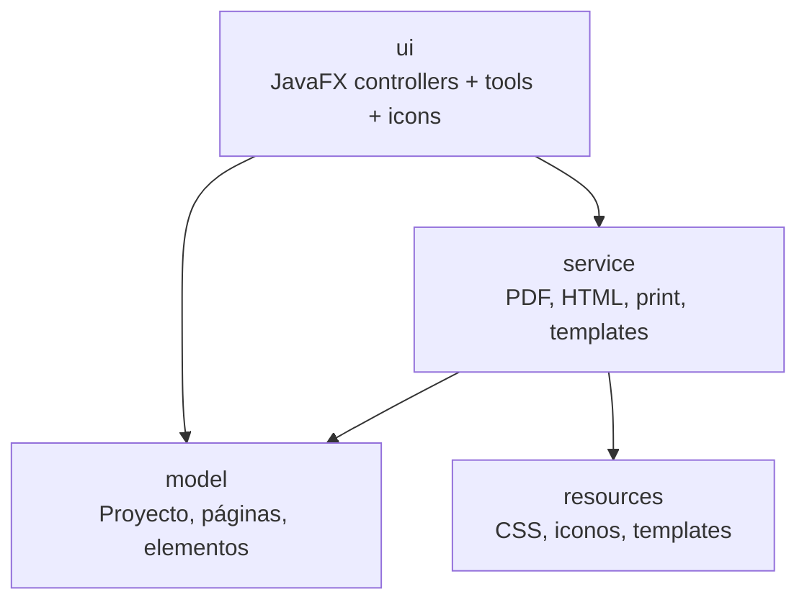
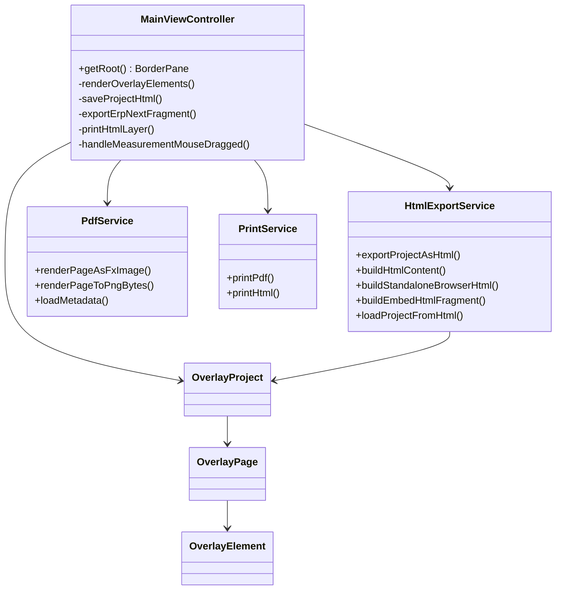
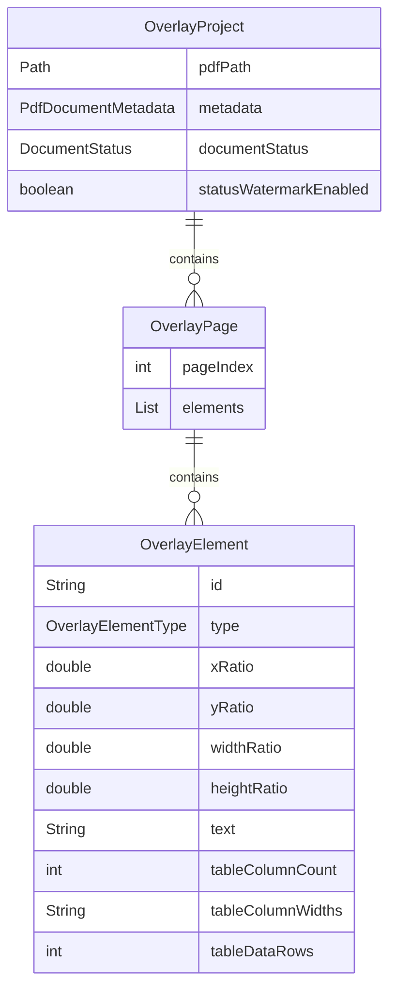
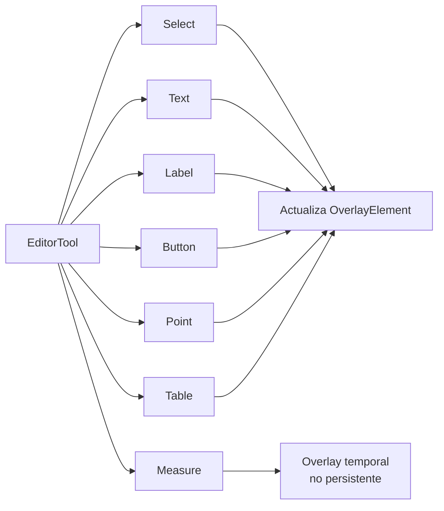
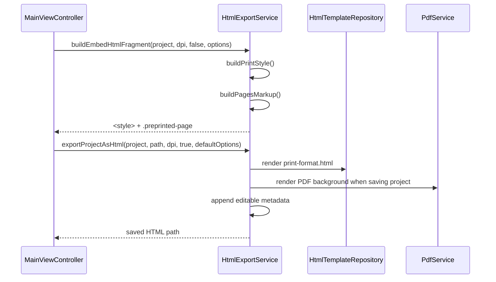

# Arquitectura

## Estado actual y evolución

Los diagramas y clases de esta guía describen la implementación actual.
Las reglas y la estructura objetivo están en
[AGENTS.md](../AGENTS.md), en particular en organización por dominio y componente
y desacople del núcleo.

Actualmente existen paquetes `model`, `service`, `template` y `ui`.
`PdfService` expone imágenes JavaFX y `PrintService` utiliza impresión y WebView
de JavaFX; estos acoplamientos deben separarse mediante adaptadores al extraer
casos de uso reutilizables desde una CLI o un servicio sin interfaz gráfica.
La aplicación ya dispone de temas; la internacionalización mediante recursos
inglés/español y la CLI forman parte de las reglas de evolución y no se declaran
implementadas en esta guía.

La migración se realizará por componentes y dentro del alcance de cada tarea,
preservando comportamiento y compatibilidad de los archivos existentes.

## Capas actuales

```mermaid
flowchart TB
    UI[ui\nJavaFX controllers + tools + icons]
    SERVICE[service\nPDF, HTML, print, templates]
    MODEL[model\nProyecto, páginas, elementos]
    RES[resources\nCSS, iconos, templates]

    UI --> SERVICE
    UI --> MODEL
    SERVICE --> MODEL
    SERVICE --> RES
```

## Responsabilidades

| Capa | Responsabilidad |
| --- | --- |
| `ui` | Interacción JavaFX, herramientas, inspector, temas y estado visual. |
| `service` | Render PDF, generación HTML, impresión y carga/guardado. |
| `model` | Estado editable del proyecto y validaciones básicas. |
| `resources` | CSS de UI, iconos y plantilla HTML base. |

## Clases Principales

```mermaid
classDiagram
    class MainViewController {
        +getRoot() BorderPane
        -renderOverlayElements()
        -saveProjectHtml()
        -exportErpNextFragment()
        -printHtmlLayer()
        -handleMeasurementMouseDragged()
    }

    class HtmlExportService {
        +exportProjectAsHtml()
        +buildHtmlContent()
        +buildStandaloneBrowserHtml()
        +buildEmbedHtmlFragment()
        +loadProjectFromHtml()
    }

    class PdfService {
        +renderPageAsFxImage()
        +renderPageToPngBytes()
        +loadMetadata()
    }

    class PrintService {
        +printPdf()
        +printHtml()
    }

    class OverlayProject
    class OverlayPage
    class OverlayElement

    MainViewController --> HtmlExportService
    MainViewController --> PdfService
    MainViewController --> PrintService
    MainViewController --> OverlayProject
    OverlayProject --> OverlayPage
    OverlayPage --> OverlayElement
    HtmlExportService --> OverlayProject
```

## Modelo de Proyecto

```mermaid
erDiagram
    OverlayProject ||--o{ OverlayPage : contains
    OverlayPage ||--o{ OverlayElement : contains

    OverlayProject {
        Path pdfPath
        PdfDocumentMetadata metadata
        DocumentStatus documentStatus
        boolean statusWatermarkEnabled
    }

    OverlayPage {
        int pageIndex
        List elements
    }

    OverlayElement {
        String id
        OverlayElementType type
        double xRatio
        double yRatio
        double widthRatio
        double heightRatio
        String text
        int tableColumnCount
        String tableColumnWidths
        int tableDataRows
    }
```

Las coordenadas internas se conservan como ratios para adaptarse al render de
preview. La exportación convierte esos ratios a milímetros usando metadata
física de la página.

## Herramientas de UI

```mermaid
flowchart LR
    TOOL[EditorTool] --> SELECT[Select]
    TOOL --> TEXT[Text]
    TOOL --> LABEL[Label]
    TOOL --> BUTTON[Button]
    TOOL --> MARKER[Point]
    TOOL --> TABLE[Table]
    TOOL --> MEASURE[Measure]

    SELECT --> PERSIST[Actualiza OverlayElement]
    TEXT --> PERSIST
    LABEL --> PERSIST
    BUTTON --> PERSIST
    MARKER --> PERSIST
    TABLE --> PERSIST
    MEASURE --> TEMP[Overlay temporal\nno persistente]
```

`Measure` es deliberadamente temporal. No se agrega a `OverlayPage`, no se
guarda y no se exporta.

## Exportación HTML

```mermaid
sequenceDiagram
    participant UI as MainViewController
    participant S as HtmlExportService
    participant T as HtmlTemplateRepository
    participant P as PdfService

    UI->>S: buildEmbedHtmlFragment(project, dpi, false, options)
    S->>S: buildPrintStyle()
    S->>S: buildPagesMarkup()
    S-->>UI: <style> + .preprinted-page

    UI->>S: exportProjectAsHtml(project, path, dpi, true, defaultOptions)
    S->>T: render print-format.html
    S->>P: render PDF background when saving project
    S->>S: append editable metadata
    S-->>UI: saved HTML path
```

## Reglas de Mantenibilidad

- No mezclar guardado de proyecto con exportación.
- No poner estilos generados por la app en `<head>`.
- No agregar imagen original a `Export ERPNext`.
- No persistir herramientas temporales.
- Mantener tablas exportadas con anchos directos en `mm`.
- Mantener acciones de archivo en menú `File`.
