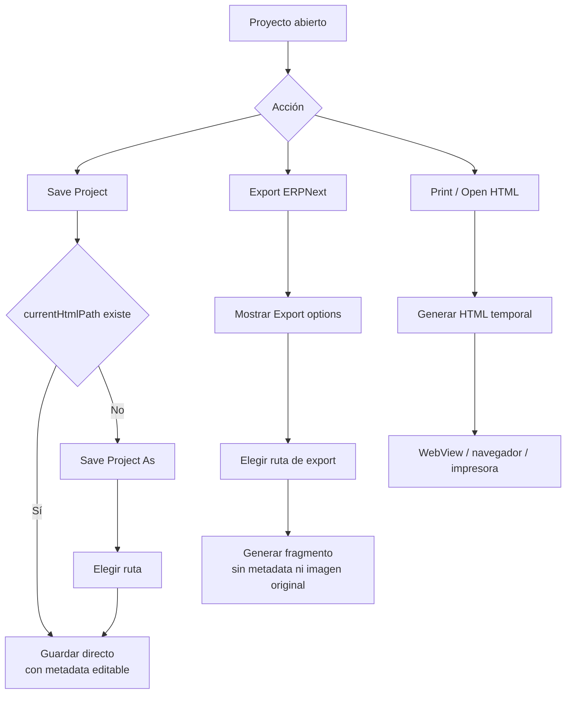
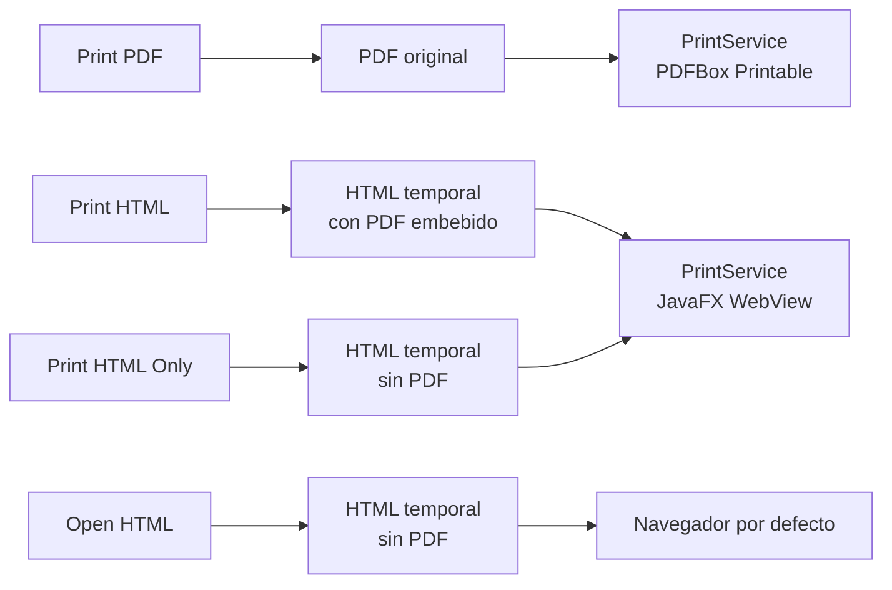

# Guardado, Exportación e Impresión

## Regla Principal

Guardar proyecto y exportar son operaciones distintas.

- Guardar conserva el proyecto editable.
- Exportar genera salida para uso externo.
- Imprimir usa salidas temporales y no modifica el proyecto.

## Flujo



## Save Project

`Save Project` escribe el proyecto en la ruta actual. Si todavía no existe
ruta, delega a `Save Project As...`.

Características:

- Incluye metadata interna `PDF_OVERLAY_METADATA_BEGIN/END`.
- Conserva datos necesarios para `Open Project HTML`.
- Usa opciones completas por defecto.
- No pregunta opciones de exportación.
- Actualiza `currentHtmlPath`.
- Limpia el estado de cambios pendientes.

## Save Project As

`Save Project As...` siempre pide ruta y guarda un nuevo archivo de proyecto.

Características:

- Misma salida editable que `Save Project`.
- Cambia `currentHtmlPath` al nuevo archivo.
- Puede usarse para renombrar o duplicar proyecto.

## Export ERPNext

`Export ERPNext...` genera salida para Print Format.

Características:

- Muestra `Export options`.
- No incluye metadata editable.
- No incluye imagen/PDF original.
- No actualiza `currentHtmlPath`.
- Parte del PDF/proyecto fuente para sugerir nombre de archivo.

Formato inicial del fragmento:

```html
<style>
/* CSS generado por esta aplicación */
</style>
<div class="preprinted-page">
    <!-- páginas y controles exportados -->
</div>
```

## Plantilla Completa

Para render standalone o previsualización con plantilla, los estilos propios
de la aplicación van dentro de `.print-format`, no en `<head>`.

```html
<!DOCTYPE html>
<html>
<head>
</head>
<body>
    <div class="print-format-gutter">
        <div class="print-format">
            <style>{{ print_style }}</style>
            {{ body }}
        </div>
    </div>
</body>
</html>
```

Las llamadas Jinja para incluir CSS externo no pertenecen a esta plantilla y no
deben generarse.

## Impresión



## Reglas de Exportación Física

- Usar `mm` para medidas exportadas.
- No usar porcentajes para layout final.
- Mantener ancho de tablas y columnas en valores directos.
- No incluir imagen original en export ERPNext.
- Mantener estilos generados dentro del cuerpo imprimible.
